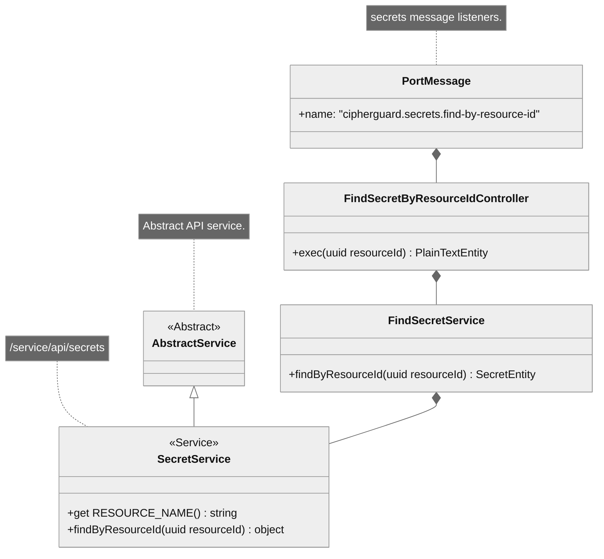

```mermaid
%%{init: {'theme':'neutral'}}%%
classDiagram
    note for PortMessage "secrets message listeners."
    class PortMessage{
        +name: "cipherguard.secrets.find-by-resource-id"
    }

    class FindSecretByResourceIdController{
        +exec(uuid resourceId) PlainTextEntity
    }

    class FindSecretService{
        +findByResourceId(uuid resourceId) SecretEntity
    }

    note for SecretService "/service/api/secrets"
    class SecretService {
        <<Service>>
        +get RESOURCE_NAME() string
        +findByResourceId(uuid resourceId) object
    }

    note for AbstractService "Abstract API service."
    class AbstractService {
        <<Abstract>>
    }

    AbstractService<|--SecretService
    FindSecretService*--SecretService
    FindSecretByResourceIdController*--FindSecretService
    PortMessage*--FindSecretByResourceIdController
```
